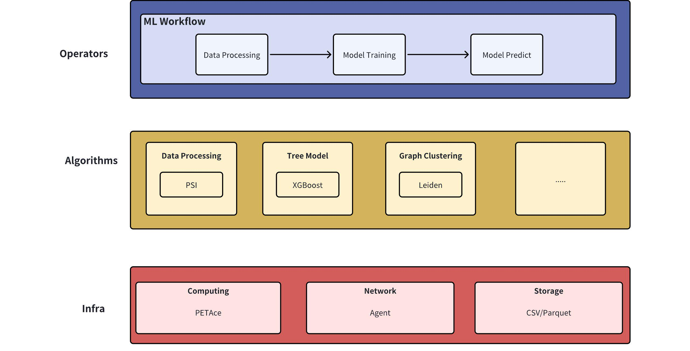

# PETML
Privacy-Enhance-Technology Machine learning (PETML) is an open-source framework facilitates data collaboration among
multi-parties while ensuring data security and privacy. It allows users to smoothly construct and develop federated
learning algorithms or privacy-preserving machine learning. PETML supports the ability to construct an algorithm
workflow that integrates components such as data processing, model training, and model prediction, thereby offering
a comprehensive suite for algorithm development requirements. PETML leverages the capability of
[PETAce](https://github.com/tiktok-privacy-innovation/PETAce) to deliver the foundational secure computing protocol,
thereby facilitating secure computational operations.



The above figure illustrates the framework of PETML. The infra layer encapsulates fundamental components like MPC, Network and storage,
offering the foundational capabilities required for the algorithm layer. This algorithm layer is responsible for developing
the core algorithms. Finally, the operation layer serves as an interface with the platform layer, supplying the essential
algorithmic unit components for utilization by the platform or users.

## Getting Started

### Requirements:
|System|Toolchain|
|------|-------|
|Linux/Debian|Python (==3.9), pip(>=23.3.1)|

## User installation

PETAce must be installed first. Please refer to [PETAce](https://github.com/tiktok-privacy-innovation/PETAce) to build petace.whl package

```
pip install peatce.whl
```

Secondly, the user is required to utilize pip to install the dependencies enumerated in the requirements

```
pip install -r requirements.txt
```

Upon successful installation of the dependencies, PETML can be installed using

```
python3 setup.py install
```

## Quick Start

We provide an example to help you quickly use PETML. Below is a quick case about federated Leiden algorithm.
> Note: If you wish to experiment with your own dataset or adjust any parameters, simply modify the corresponding
value in the configuration dictionary in examples/leiden.py. For more detailed information on the parameters,
please refer to the provided documents in the algorithm list section. Please remember to verify the consistency of
the data features provided by the two parties. If not, it is recommended to initially perform a Private Set Intersection (PSI) operation.

```
python3 examples/leiden.py -p party_a
python3 examples/leiden.py -p party_b
```


## Algorithm list

Federated preprocessing: PSI
Federated Machine Learning Algorithms: GBDT, graph clustering
Model Evaluation: Binary｜Regression evaluation

|         |                                                                Operator Name                                                                 | Documentation                                                         |
|---------|:--------------------------------------------------------------------------------------------------------------------------------------------:|-----------------------------------------------------------------------|
| PSI     |                                                              preprocessing.PSITransform                                                               | [PSI](./docs/user_guide/PSI.md)                                       |
| Leiden  |                                                                 graph.LeidenTransform                                                                 | [Federated Leiden](./docs/user_guide/Federated_Leiden.md)             |
| XGBoost | boosting. XGBoostClassifierFit <br/>boosting.XGBoostClassifierPredict<br/> boosting.XGBoostRegressorFit<br/>boosting.XGBoostRegressorPredict | [Horizontal SecureBoost](./docs/user_guide/Horizontal_SecureBoost.md) |

More to come.

## Contribution
Please check [Contributing](CONTRIBUTING.md) for more details.

## Code of Conduct

Please check [Code of Conduct](CODE_OF_CONDUCT.md) for more details.

## License

This project is licensed under the [Apache-2.0 License](LICENSE).

## Disclaimer
This software is not an officially supported product of TikTok. It is provided as-is, without any guarantees or
warranties, whether express or implied.
