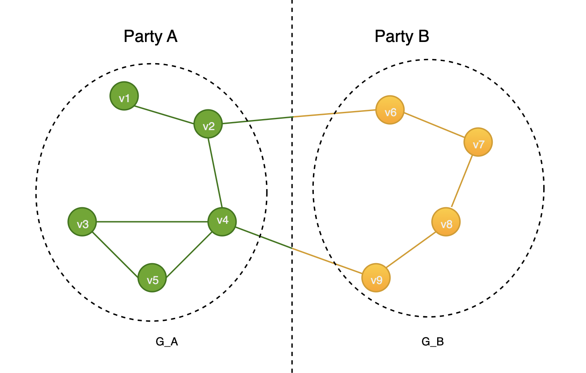

# Federated Leiden

## Introduction
Community detection algorithms aim to identify groups of nodes in a network that are more densely connected  than the
rest of the network. One such algorithm is the Leiden algorithm, which is a refinement of the Louvain algorithm.

In the cross-party scenario, the network is distributed among multiple parties, each responsible for handling a specific
portion of the global graph. The federated Leiden algorithm enables community detection across parties while protecting
data privacy.

## Leiden Algorithm
The problem of community detection requires the partition of a graph into communities of densely connected vertices, with
the vertices belonging to different communities being only sparsely connected. The Leiden algorithm is based on the Louvain
algorithm. It maximizes modularity (see Eq(1) in [[1]](#reference)) by joining vertices into communities when it increases
modularity, which is conducted in two iteratively repeating phases: **Move nodes** and **Aggregate nodes**. More details
of Leiden can be found in [[1]](#reference).

## Details of Federated Leiden
### Setting
#### Scenario setting
Our proposal is designed for two parties (A & B), to jointly build a secure Leiden model. Under this scenario, each party
can only observe a small subgraph of the network.

From the diagram above, the entire network  $G$  is composed of sub-networks $G_A$  and $G_B$ from two parties. We refer
to the vertices that connect sub-networks as '**ghost vertices**', while the remaining ones are termed '**local vertices**'.
Edges that link vertices within the same party are established in plaintext locally. While, edges that link vertices across
different parties exist in the form of secret shares, distributed within the two involved parties. For vertices belonging
to party B, party A only knows the de-identified vertex information. The same applies to party A.

#### Security setting
To ensure a secure two-party computation, we will employ the MPC protocol of [PETAce](https://github.com/tiktok-privacy-innovation/PETAce)
in a semi-honest adversarial environment. PETAce provides computation protocols under two-party settings. The protocols include:
- Secure 2-party Addition: $[z]=[x]+[y]$
- Secure 2-party Multiplication: $[z]=[x]\cdot[y]$
- Secure 2-party Division: $[z]=[x]/[y]$
- Secure 2-party Argmax: $[z]=argmax([x])$

### Algorithm Details
The Federated Leiden algorithm is also conducted in two iteratively repeating phases. We will use MPC to do calculation
in both phases when the vertex is ghost vertex.

**Move nodes:**
The algorithm behaves differently based on the parties involved in the vertices. If all vertices belong to the same party,
the computation is executed in plaintext, as outlined in [[1]](#reference)). On the other hand, if vertices come from different
parties, the computation of modularity is carried out using MPC. Lastly, the secure two-party argmax function is used to decide the
direction of movement for the node that maximizes the value of modularity.

**Aggregate nodes:**
We call a vertex **cross-party** if it is aggregated from vertices of different parties. Similar to the step in the Move nodes
phase, if all vertices belong to the same party, the computation is executed in plaintext. If vertices from multiple parties
are involved, secure 2-party addition is used to aggregate values derived from the edges within the network.

We are preparing a detailed whitepaper that will provide in-depth information about the algorithm. Please stay tuned if you are interested.


## Config

### Module Name
```
petml.operators.graph.LeidenTansform
```

### Model Parameters
| Name      | Type | Description                         | Default |
|-----------|------|-------------------------------------|---------|
| ```max_move```  | int  | The limit times of local node move  | 20      |
| ```max_merge``` | int  | The limit times of merge meta nodes | 10      |

### Input
| Name         | File Type | Description                    |
|--------------|-----------|--------------------------------|
| user_weights | json      | The weight of user-user weight |
| local_nodes  | json      | The local nodes of each party  |

### Output

| Name    | File Type | Description                    |
|---------|-----------|--------------------------------|
| cluster | csv       | The result of Leiden algorithm |

### Examples
```
 config = {
    "common": {
        "max_move": 20,
        "max_merge": 10,
        "network_mode": "petnet",
        "network_scheme": "socket",
        "parties": {
            "party_a": {
                "address": ["127.0.0.1:50011"]
            },
            "party_b": {
                "address": ["127.0.0.1:50012"]
            }
        }
    },
    "party_a": {
        "inputs": {
            "user_weights": "examples/data/karate_club_user_weight1.json",
            "local_nodes": "examples/data/karate_club_local_nodes1.json",
        },
        "outputs": {
            "cluster": "tmp/server/cluster.csv"
        }
    },
    "party_b": {
        "inputs": {
            "user_weights": "examples/data/karate_club_user_weight2.json",
            "local_nodes": "examples/data/karate_club_local_nodes2.json",
        },
        "outputs": {
            "cluster": "tmp/client/cluster.csv"
        }
    }
}

#if run the code in party a, the party should be 'party_a' and vice versa
operator = petml.operators.graph.LeidenTansform(party)
operator.run(config_map)
```

## Reference
[1] [From Louvain to Leiden: guaranteeing well-connected communities](https://www.nature.com/articles/s41598-019-41695-z.pdf)
