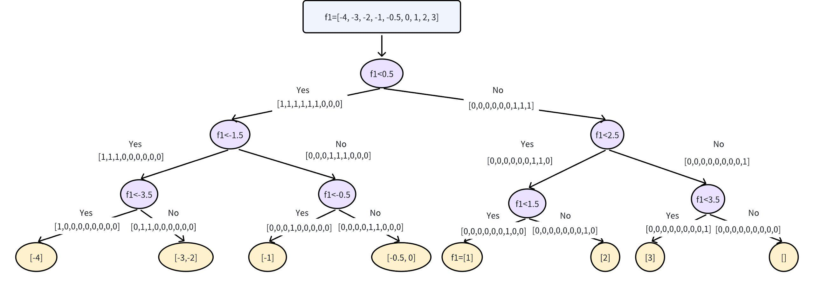
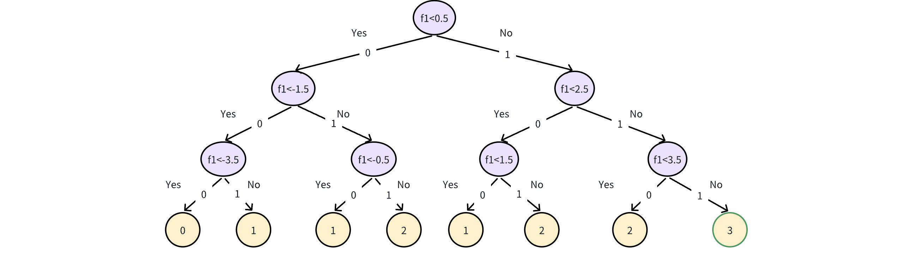

# Horizontal SecureBoost

## Introduction
PETML implements **secure gradient descent decision tree model** training and inference using **secure multi-party computation**.
It currently supports training for regression problems and binary classification problems within two parties.

## XGBoost Algorithm
Gradient Boosting Decision Tree (GBDT) is a widely used statistical model for classification and regression problems.
We sketch the key steps of XGBoost below and refer readers to the paper [[1]](#references) for details.


According to [[1]](#references), the steps of building one tree are:

- Step 1: Based on the loss function, the first derivative $g_i$ and the second derivative $h_i$ for each sample are
calculated by ground truth label and current predicted values. Taking logistic regression as an example,
$g_i= sigmoid(y_{pred_i}) - y_{truth_i}$$ and $$h_i = sigmoid(y_{pred_i})*(1 - sigmoid(y_{pred_i}))$.

- Step 2: The sample that yields the largest gain is selected to perform the split in the current node.
This is achieved by enumerating all samples under each feature. (Please refer to the Eq (7) in the paper [[1]](#references).)

- Step 3: Upon identifying the split points, the data is split into two parts, which are then allocated to the left and
right subtrees respectively. The training continues to the next level, repeating Step 2 until the conditions for tree growth
termination are fulfilled.

- Step 4: The weight of the leaf node is determined by the samples that fall into it. It is computed using the leaf weight
formula Eq (5) in [[1]](#references).


## Secure-XGBoost Algorithm
To ensure no sample information is leaked, we use secure two-party computation protocol to implement the addition,
multiplication, comparison, and other necessary operations in the training and inference algorithms of GBDT.
The split feature, split points, and leaf weight values in the tree models are saved in the format of secure shares to
ensure that no information is leaked. We implement Secure-XGBoost using [PETAce](https://github.com/tiktok-privacy-innovation/PETAce),
which provides implementations of the underlying MPC protocols.

In short, our secure-XGBoost algorithm replaces the plaintext operations of XGBoost sketched above with their corresponding
secure two-party computation versions, except Step 3. In Step 3, data splitting could lead to uneven data sizes in the left
and right subtrees depending on the input data distribution. To remove such leakage, we use all samples to calculate the gain
at every split node in each layer of the tree.

To achieve this, we use an additional secret sharing vector which has the same length as samples and can be regarded as
the index array of the training samples, denoted as $V$. The initial value for all elements in $V$ at the root node
will be set to 1. After identifying the optimal split point through gain calculation, we employ secret sharing comparisons
with secure 2-party selection protocol to identify samples that are larger than the split point. Then, based on the index,
we locate the corresponding positions of these samples in the $$V$$ and set them to 0. Here, we have the new index array
$V_{left}$ for left subtree. The same steps are repeated for the right subtree. During the subtree calculations,
we multiply $g$ and $h$ with the $V$ by  secure 2-party multiplication.

The growth of the tree stops when it reaches the maximum depth set by the user. Note that different datasets may result
in different tree structures. To prevent potential attacks based on the structure of the tree, we construct a full binary
tree. If the tree cannot find the optimal split in the current node, it will use the split information from its parent node
to ensure accurate results.

The key steps of building one secure tree are:
- Step 1: The first derivative $g_i$ and the second derivative $h_i$ for each sample are computed using the secret sharing-based
MPC protocol. Using logistic regression as an example, secure 2-party operations such as sigmoid, multiplication, and
subtraction are used.
- Step 2: The formula employed for the computation of gain incorporates secure 2-party addition, multiplication, and division at each iteration.
- Step 3: As discussed above.
- Step 4: The formula employed for the computation of leaf weight incorporates secure 2-party addition, and division.


<center>Figure 1: Tree-building process</center>

Assume we have a dataset with only one feature $f_1$. The tree identifies the optimal
split value in the first layer by enumerating all samples and obtaining a result with the split value 0.5. Using the secure
two-party comparison protocol, we can derive two index arrays,  $V_{left} = [1,1,1,1,1,0,0,0]$ and $V_{right} =[0,0,0,0,0,1,1,1]$.
In the second layer of the left node, we multiply all samples with $V_{left}$ to  identify the samples that fall into the left node
and repeat the progress in the first layer to find the optimal split value. The tree is constructed by repeating this process.

## Model Secure-Inference
To mitigate the information leakage, all inference samples have to do secret comparisons with all decision nodes in each
tree. By sum of all the edges in the tree from the root to that node by using a secure 2-party addition protocol, we can
generate a secret vector $S$ that represents all paths to the leaf nodes as in Figure 2. Then, comparing secret vector
$S$ with the depth of the tree using a secure 2-party comparison protocol, we get the inference result corresponding to the sample.


<center>Figure 2: Model inferencing process</center>
Assume we have an inference sample with the feature $f_1=4$. This value will be
compared with all decision nodes in the tree using the secure comparison protocol. Summing up the output of the comparison
via secure 2-party addition across all root-to-leave paths results in the vector$[0,1,1,2,1,2,2,3]$. By comparing this
result with the depth (=3) of the tree, we obtain the result indicator array $[0,0,0,0,0,0,0,1]$, namely the inferencing
result is the last leave node.

## Classifier Config
### Training
#### Module Name
```
petml.operators.boosting.XGBoostClassifierFit
```

#### Module Parameters
| Name                    | Type  | Description                                                                                                                       | Default  |
|-------------------------|-------|-----------------------------------------------------------------------------------------------------------------------------------|----------|
| ```min_split_loss```    | float | The minimum number of gain to split an internal node                                                                              | 1e-5     |
| ```learning_rate```     | float | Learning rate shrinks the contribution of each tree by ```learning_rate```                                                        | 0.1      |
| ```n_estimators```      | int   | The number of boosting stages to perform                                                                                          | 100      |
| ```base_score```        | float | Initial value of $y_hat$                                                                                                          | 0.5      |
| ```max_depth```         | int   | Maximum depth of the tree                                                                                                         | 3        |
| ```reg_alpha```         | float | L1 regularization term on weights                                                                                                 | 0.       |
| ```reg_lambda```        | float | L2 regularization term on weights                                                                                                 | 1.       |
| ```min_child_samples``` | int   | The minimum number of samples required to be at a leaf node                                                                       | 1        |
| ```min_child_weight```  | float | The minimum sum of instance weight (hessian) needed in a child                                                                    | 0.5      |
| ```test_size```         | float | Size of eval dataset of input data                                                                                                | 0.3      |
| ```eval_epochs```       | int   | Calculating the evaluation metric after every certain number of epochs                                                            | 10       |
| ```eval_threshold```    | float | Regard the instances with eval prediction value larger than threshold as positive instances, and the others as negative instances | 0.5      |
| ```objective```         | str   | The loss function to be optimized                                                                                                 | logitraw |


#### Input
| Name | File Type | Description |
| --- |-----------| --- |
| train_data | csv       | The training dataset |

#### Output

| Name | File Type | Description |
| --- |-----------| --- |
| model_path | json      | The trained model |

#### Examples
```
config = {
    "common": {
        "objective": "logitraw",
        "n_estimators": 10,
        "max_depth": 3,
        "reg_lambda": 1,
        "reg_alpha": 0.0,
        "min_child_weight": 0.1,
        "base_score": 0.5,
        "learning_rate": 0.1,
        "network_mode": "petnet",
        "network_scheme": "socket",
        "label_name": "label",
        "test_size": 0.3,
        "parties": {
            "party_a": {
                "address": ["127.0.0.1:50011"]
            },
            "party_b": {
                "address": ["127.0.0.1:50012"]
            }
        }
    },
    "party_a": {
        "inputs": {
            "train_data": "data0.csv",
        },
        "outputs": {
            "model_path": "model_name0.json"
        }
    },
    "party_b": {
        "inputs": {
            "train_data": "data1.csv",
        },
        "outputs": {
            "model_path": "model_name1.json"
        }
    }
}

#if run the code in party a, the party should be 'party_a' and vice versa
operator = petml.operator.boosting.XGBoostClassifierFit(party)
operator.run(config_map)
```

### Inference
#### Module Name
```
petml.operators.boosting.XGBoostClassifierPredict
```

#### Input
| Name         | File Type | Description           |
|--------------|-----------|-----------------------|
| predict_data | csv       | The inference dataset |
| model_path   | json      | The trained model     |


#### Output

| Name               | File Type | Description             |
|--------------------|-----------|-------------------------|
| inference_res_path | csv       | The result of inference |


#### Examples
```
config = {
    "common": {
        "network_mode": "petnet",
        "network_scheme": "socket",
        "parties": {
            "party_a": {
                "address": ["127.0.0.1:50011"]
            },
            "party_b": {
                "address": ["127.0.0.1:50012"]
            }
        }
    },
   "party_a": {
    "inputs": {
        "predict_data": "data0.csv",
        "model_path": "model_name0.json"
    },
    "outputs": {
        "inference_res_path": "predict0.csv"
    }
},
"party_b": {
    "inputs": {
        "predict_data": "data1.csv",
        "model_path": "model_name1.json"
    },
    "outputs": {
        "inference_res_path": "predict1.csv"
    }
}
}

#if run the code in party a, the party should be 'party_a' and vice versa
operator = petml.operator.boosting.XGBoostClassifierPredict(party)
operator.run(config_map)
```

## Classifier Config
### Training
#### Module Name
```
petml.operators.boosting.XGBoostRegressorFit
```
#### Module Parameters
| Name                    | Type  | Description                                                                                                                       | Default      |
|-------------------------|-------|-----------------------------------------------------------------------------------------------------------------------------------|--------------|
| ```min_split_loss```    | float | The minimum number of gain to split an internal node                                                                              | 1e-5         |
| ```learning_rate```     | float | Learning rate shrinks the contribution of each tree by ```learning_rate```                                                        | 0.1          |
| ```n_estimators```      | int   | The number of boosting stages to perform                                                                                          | 100          |
| ```base_score```        | float | Initial value of $y_hat$                                                                                                          | 0.5          |
| ```max_depth```         | int   | Maximum depth of the tree                                                                                                         | 3            |
| ```reg_alpha```         | float | L1 regularization term on weights                                                                                                 | 0.           |
| ```reg_lambda```        | float | L2 regularization term on weights                                                                                                 | 1.           |
| ```min_child_samples``` | int   | The minimum number of samples required to be at a leaf node                                                                       | 1            |
| ```min_child_weight```  | float | The minimum sum of instance weight (hessian) needed in a child                                                                    | 1            |
| ```test_size```         | float | Size of eval dataset of input data                                                                                                | 0.3          |
| ```eval_epochs```       | int   | Calculating the evaluation metric after every certain number of epochs                                                            | 10           |
| ```eval_threshold```    | float | Regard the instances with eval prediction value larger than threshold as positive instances, and the others as negative instances | 0.5          |
| ```objective```         | str   | The loss function to be optimized                                                                                                 | squarederror |

#### Input
| Name       | File Type | Description          |
|------------|-----------|----------------------|
| train_data | csv       | The training dataset |

#### Output

| Name       | File Type | Description       |
|------------|-----------|-------------------|
| model_path | json      | The trained model |

#### Examples
Refer to the examples in classifier training config

### Inference
#### Module Name
```
petml.operators.boosting.XGBoostRegressorPredict
```

#### Input
| Name         | File Type | Description           |
|--------------|-----------|-----------------------|
| predict_data | csv       | The inference dataset |
| model_path   | json      | The trained model     |


#### Output

| Name               | File Type | Description             |
|--------------------|-----------|-------------------------|
| inference_res_path | csv       | The result of inference |


#### Examples
Refer to the examples in classifier inference config

## References
[1] [XGBoost: A Scalable Tree Boosting System](https://arxiv.org/abs/1603.02754)
